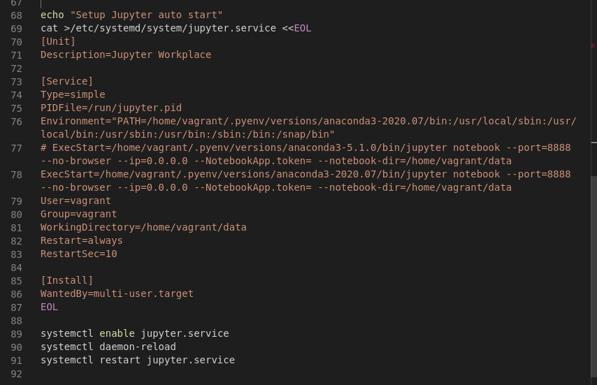
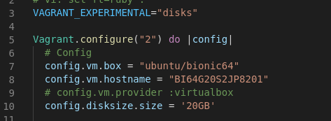

## Summary

* Originally this Vagrant VM installed on `trusty64` and old Anaconda3
* Added newer Anaconda3, RStudio server. Changed OS to `bionic64`
* Hard disk was 10 GB. Increased to 20 GB.
* Two provisioning shell scripts: one for root and the second for user configuration
* New port for Jupyter notebooks http://127.0.0.1/8201
* New port for RStudio server http://127.0.0.1/8701
* Add package `welly`
* Add machine learning packages theano, tensorflow, keras, sklearn
* Fix `jupyter.service` configuration file to include path to Anaconda3 binaries
* Change Anaconda3 version to` 2020.07`
* Change OS to Ubuntu 18.04 `bionic64`
* Installs Anaconda3-5.1.0 with `pyenv`
* Install virtual environment with `pyenv`
* Originally built from `config.vm.box = "ubuntu/xenial64"`
* Original port for Jupyter with browser at http://localhost:8888/


### Install littler

Borrow code from Docker container

```
Rscript -e "install.packages(c('littler', 'docopt'), repo = '$MRAN')"
ln -s /usr/local/lib/R/site-library/littler/examples/install2.r /usr/local/bin/install2.r \
  && ln -s /usr/local/lib/R/site-library/littler/examples/installGithub.r /usr/local/bin/installGithub.r \
  && ln -s /usr/local/lib/R/site-library/littler/bin/r /usr/local/bin/r \
  
```


### packages not available in R-3.4.4

```
install2.r --error --repo https://mran.microsoft.com/snapshot/$BUILD_DATE \
  Rcpp \
  base64enc \
  digest \
  evaluate \
  glue \
  highr \
  htmltools \
  jsonlite \
  knitr \
  magrittr \
  markdown \
  mime \
  rmarkdown \
  rprojroot \
  stringi \
#   tinytex \
#   xfun \
  yaml
```


## Make Jupyter auto start with newer Anaconda3 versions

Add this line:

```
Environment="PATH=/home/vagrant/.pyenv/versions/anaconda3-2020.07/bin:/usr/local/sbin:/usr/local/bin:/usr/sbin:/usr/bin:/sbin:/bin:/snap/bin"
```




## Hard disk from 10 GB to 20 GB




These two lines:

```
VAGRANT_EXPERIMENTAL="disks"
...
config.disksize.size = '20GB'
```

