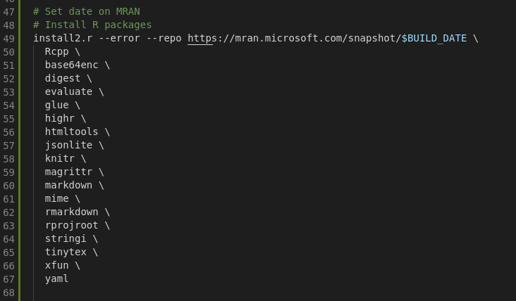

[toc]


## TODO

* Provision R packages required to create Rmarkdown notebooks
* ~~Use newer Vagrant box `ubunut/bionic` with 40 GB disk~~
* Make a project folder (sync'ed) for Jupyter and RStudio
* ~~Get LAS files and deposit them in folder `raw_data`~~
* ~~Add folder to export generated data in first notebook.~~
* ~~Install RStudio server and expose port 8787~~
* ~~Install R packages for Rmarkdown notebooks~~
* ~~Change ports to something we can remember~~
* ~~Text banner to show Jupyter and RStudio ports at `vagrant up`~~
* ~~Use `install2.r` to install R packages~~


## Q&A

* Is there a way to increase the disk size without lots of OS commands? 
    **Answer**: Yes. We will need to use a Vagrant experimental feature `VAGRANT_EXPERIMENTAL="disks"`.
* Is there a way to execute the Jupyter server as a user? 
    **Answer**: Yes. But it would be a different configuration. An alternative is `jupyterhub`.
* Why shell commands cannot be executed from Jupyter with `!`? Or we get this message: `Error /bin/bash: conda: command not found`. 
    **Answer**: Because `jupyter.service` is lacking the path to the Jupyter binaries in `~/.pyenv/versions/anaconda3-2020.07`. Adding this to the path using `Environment=` should fix it.
* Should we use `pyenv` to install `conda` environments? 
    **Answer**: Both, pyenv and conda, have different objectives. Although `pyenv` is good at managing Python versions and environments, and also is able to install Anaconda Python versions, if we want the full spectrum of `conda` environment commands, we should stick to `conda`.


# 20210125

*   Install R package `reticulate`

*   Copy LAS files from Volve dataset.

    ```
    1.7M  WL_RAW_BHPR-GR-MECH_MWD_1.LAS
    728K  WL_RAW_BHPR-GR-MECH_MWD_2.LAS
    1.3M  WL_RAW_BHPR-GR-MECH_MWD_3.LAS
     11M  WL_RAW_BHPR-GR-MECH_TIME_MWD_1.LAS
    6.0M  WL_RAW_BHPR-GR-MECH_TIME_MWD_2.LAS
    9.2M  WL_RAW_BHPR-GR-MECH_TIME_MWD_3.LAS
    ```

    

*   Files originally located under `Well_logs_pr_WELL/15_9-F-14/02.LWD_EWL`.

*   Copied to folder `./navarro/raw_data`

# 20210119

*   Push branch with `rstudio-server`. Not yet merged with `main`.

    ```
    git push --set-upstream origin 210117-add_rstudio_server
    ```

    

*   Change ports to 8801 and 8701 for Jupyter and RStudio.
    

*   Change welcome banner to:

    


# 20210118


*   Use `install2.r`, `MRAN` and `BUILD_DATE` to install R packages
    
*   Set environment variables for `BUILD_DATE` and `MRAN` formed URL
    

*   Use `wget` instead of `curl` to download and place `install2.r` file

# 20210117

* Do not download RStudio installer every time we provision the VM.
    
* Installed `rstudio-server-1.3.1093-amd64.deb`. User is `vagrant`, password is `vagrant`
    
* Provisioning package `welly` as user (`provision-vagrant-user.sh`)
* Add flexible folders for raw data and exported/generated data for all notebooks. Find the project root and then build the paths from there.
* Add shared folder `navarro`
* New branch `navarro` with three notebooks and a data file `LWD_F14.csv`.

# 20210116
*   Fix problem with `jupyter.services` and new versions of Anaconda3 installed by `pyenv`. Add path to pyenv binaries using`Environment=` in the configuration file:
    
*   Add some deep learning libraries:
    
    
*   Disk size increased to 20 GB:
    
    

# 20210115-night
* Skip installing deep learning packages
* Comment the lines of the VM name to see if this affects running conda from the shell.
# 20210115-day
* Ignore binary `Anaconda3-2020.07-Linux-x86_64.sh` for now.
* Machine needs to increase disk size above 10 GB.
* Change Jupyter server port to 8200.
* Install default R from VM terminal. It installs R-3.4.4 with `sudo apt install r-base`. Need to use another repo for `R-3.5.3` or higher.

* Tried to install `Anaconda3-2020.07-Linux-x86_64.sh` using `pyenv` but it will not work. Cannot install from binary error. `pyenv` only allows a keyword not a binary file as argument.

    ```
    pyenv install Anaconda3-2020.07-Linux-x86_64.sh    # this will not work
    ```

    

    ```
    config.vm.provision "file", source: "Anaconda3-2020.07-Linux-x86_64.sh", destination: "/home/vagrant/Anaconda3-2020.07-Linux-x86_64.sh"
    ```

    

*   Install `plotnine` from script.

*   Installed `tensorflow` and `keras` from provisioning script. Disk space `/dev/sda1 9.7G 6.9G 2.8G 72%`.

*   Install `theano` from the Vagrant provision scripts. Success! Tested with `test_theano.ipynb`.

------

# 20210114-bionic

* Failed installation of `pytorch`. Did not specify CPU only. Used this `conda install pytorch -c pytorch`. For CPU only the installation command should be `conda install pytorch torchvision cpuonly -c pytorch`.

    \* Installing `tensorflow`and `keras`. Disk space after:

    ​    

    \* Disk still 9.7 GB affects installation of many packages.

* Installing `theano`. Disk space after:
  


    
* Installing `tensorflow`and `keras`. Disk space after:
  


    
* Disk still 9.7 GB

* Add shared `notebooks` folder

* Success with new `bionic64` VM built from xenial

* Got message at the end of installation:
    
    
* Use Anaconda3-2020.07 installed with `pyenv`

* Modify the virtualbox VM with `v.name = "vagrant-bi64shsujpy-apyenv2020.07"`

* clone the xenial64 folder to create the base of `bionic64`

* remove symbolic link to vagrant folder/partition

# 20210114-xenial

* Try installing `tensorflow`. Sucess! But it ate up almost all the hard disk space (10 GB)
    
    
* Installing `mxnet`. Failed!
    Disk status after 
    ``/dev/sda1       9.7G  6.5G  3.3G  67% /``
    
    

* Deactivate plugin `vagrant-disksize`. Back to 10 GB disk.

* Try increasing disk size from 10 GB to 20 GB. Crashed the VM. New size is recognized. Using plugin `vagrant-disksize`.

* Installing mxnet on folder data. Success!
  
    
* Tested installing a different `pyenv` with Anaconda.

* Tested installation of `theano`. Success!

